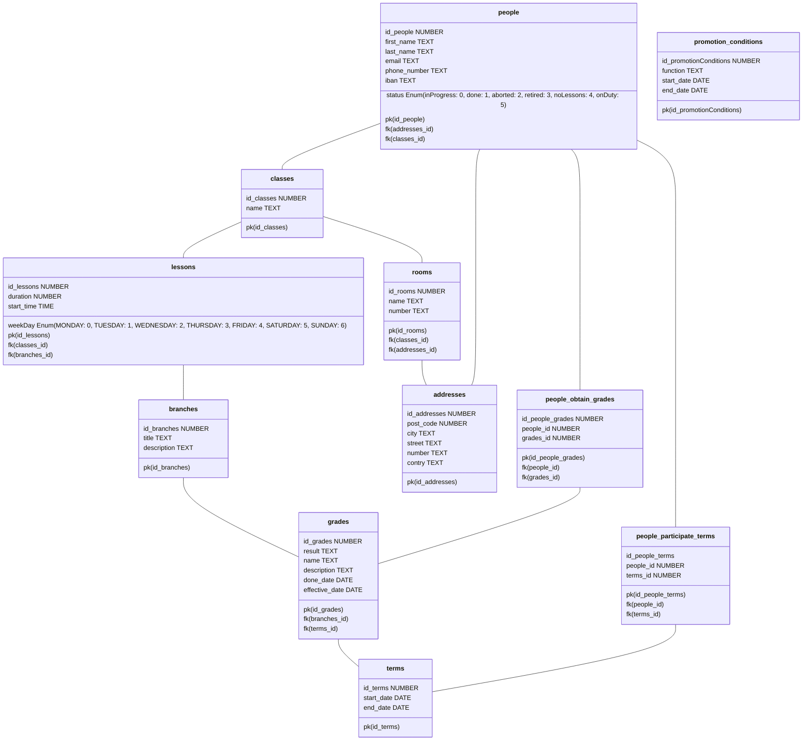

# Noé Zwissig analyse

# First mind idea on paper
## V1

## V2

## V3

# MCD V1.0

# MCD V2.0

# MLD

In this MLD something as been upgraded. The tables are now in plural. Some typo as also been corrected.

    
## fix inside the v2:
Update the person table to add the status enum inside.\
Correct the "note" table as "grade" and the "note" as result.\
add startTime in lesson

# Decision and explanation

# Question

Est-ce que tous les élève au sein d'un classe on FORCEMENT les même leçon ?
: OUI

Quel info voulez-vous pour les élève ?
: horaire par semestre
nom
prénom
adresse
email
téléphone
statut -> en cours, terminé, abandonné
  
Quel info voulez-vous pour les enseignants ?
: planning
nom
prénom
adresse
email
téléphone
statut -> retraite,pas de cours, en fonction
iban

Quel info voulez-vous pour les cours ?
: nom
description
semestre ou il est donnée (évolutif)
horaire
note
semestre 

Quel info pour les notes ?
: nom
description
Date de réalisation

Avez-vous des cas spéciaux que vous voulez que nous tenions compte ? 
: aucun 

Des semaines spécial ?
: non

Des appuis ?
: non aucun

Des fonctionnalité que vous voulez que la future application soit capable de faire ?
: aucune

Seulement 3 Entité ? par de salle, bâtiment ou autre ? 
: salle -> tout les cours sont dans la même salle pour une classe (peut changer) 
  
Voulez-vous un historique ?
: oui

Comment fonctionne les promotion ? trimestre semestre libre ? 
: par trimestre et moyenne de toute les notes supérieur a 4 et module validé

Est-ce que vous voulez que les conditions de promotion soie stockée dans la db ? 
: oui stocké les fonction
et garder un historique

Est-ce que le prof est déterminer par la branche ou par la leçon ?  
: toujours le même prof par branche
mais peut changé année après année

Voulez-vous pouvoir attribué certaine chose à une période spécifique ? (devoir)
: NON

Note de discusion :
: l'horaire sera générer 
chaque trimestre est parfaitement identique sur toute les semaine  qui le compose.(semaine type)
un élève peut devenir enseignant